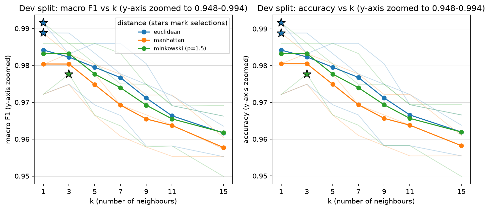
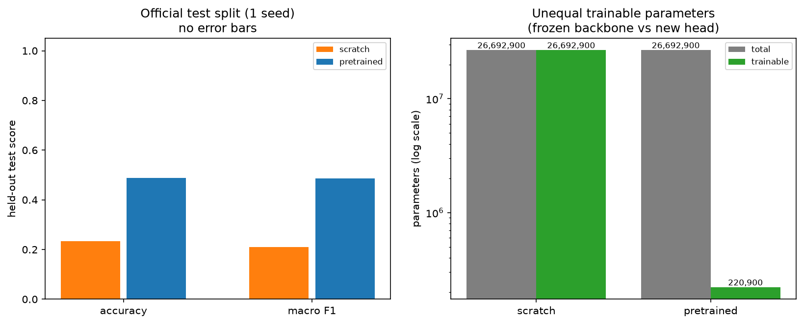

# CSC 781 — Machine learning, revisited

Three graduate-course experiments rebuilt as reusable Python modules, with
corrected methodology, behavioral tests, and freshly measured results.
By Jadon Calvert. Original submissions and instructor materials are not included;
this repository starts with separate, clean Git history.

## What I built

- **NumPy k-NN:** all-feature distances, reusable neighbor rankings, deterministic
  majority voting, and development-set hyperparameter selection.
- **NumPy logistic regression:** stable sigmoid and logit-based cross-entropy,
  analytic gradients, full-batch gradient descent, and training-only scaling.
- **Transfer-learning protocol:** modern torchvision weights and preprocessing,
  frozen backbone parameters **and BatchNorm buffers**, development checkpoint
  selection, and one final evaluation on the official test split.
- **Evidence:** seeded stratified splits, behavioral regression tests, recorded
  environments and runtimes, JSON results, and figures generated from those results.

NumPy supplies numerical primitives; scikit-learn supplies datasets, splitting,
metrics and reference estimators. DenseNet-161, ImageNet weights and their transform
recipe come from torchvision—not an architecture or pretrained model I invented.

## Measured results

Classical experiments use seeds 42/43/44; `±` is their population standard
deviation, not a confidence interval. DenseNet uses **one seed, one epoch,
64-pixel inputs, and the full CIFAR-100 dataset**. Each row has its own metric.

| Experiment | My implementation/protocol | Reference | Held-out metric |
| --- | --- | --- | --- |
| Digits k-NN | **0.9805 ± 0.0045** | sklearn: 0.9805 ± 0.0045 | 10-class macro F1 |
| Breast-cancer logistic regression | **0.9719 ± 0.0057** | sklearn LBFGS: 0.9369 ± 0.0128 | Malignant-class F1 |
| CIFAR-100 DenseNet-161 | Scratch: **0.2103** | Frozen ImageNet backbone + new head: **0.4854** | 100-class macro F1 |

The [JSON files](results/) retain full metrics, selections, settings, package
versions, hardware and timings. These are reruns, not historical submission scores.

## Setup

Install [uv](https://docs.astral.sh/uv/), clone this repository, and run commands
from its root. Python 3.12 and package versions are pinned in `uv.lock`.

```sh
uv sync --locked
```

The base environment supports both classical experiments and all notebooks without
PyTorch. The transfer command adds the optional `deep-learning` extra, which uses
CPU-only torch/torchvision wheels. Recorded hardware: AMD Ryzen 7 7840U; transfer
uses four torch threads. For CUDA, use a separate environment configured with the
[official PyTorch installer](https://pytorch.org/get-started/locally/); no GPU run
is claimed here.

## 1. k-NN from scratch

**Question:** does handwritten distance/ranking/voting reproduce scikit-learn on
identical data and selected hyperparameters? All three recorded splits produced
identical test predictions. The development sweep—not the test set—chooses `k`
and the distance metric. About one second per seed on the recorded machine.



```sh
uv run --locked python -m mlshowcase.knn --output-dir results --seeds 42 43 44
```

[Study](docs/knn.md) · [Code](mlshowcase/knn.py) ·
[Notebook](notebooks/knn.ipynb) · [Tests](tests/test_knn.py) · [Evidence](results/knn.json)

## 2. Numerically stable logistic regression

**Question:** can a stable handwritten model be evaluated without preprocessing
or selection leakage? Scaling is fitted on training only; learning rate and
threshold are selected jointly on development data. The 3,000-step GD fits did
**not** converge. The independently threshold-selected LBFGS baseline uses a
different stopping rule: the score gap does not establish a generally better
solver. Roughly 0.7–0.8 seconds per seed. **Not for clinical use.**


```sh
uv run --locked python -m mlshowcase.logistic --output-dir results --seeds 42 43 44
```

[Study](docs/logistic.md) · [Code](mlshowcase/logistic.py) ·
[Notebook](notebooks/logistic.ipynb) · [Tests](tests/test_logistic.py) · [Evidence](results/logistic.json)

## 3. DenseNet transfer learning

**Question:** does a frozen ImageNet representation help under the same
one-epoch training budget? Both variants use 45,000 training, 5,000 development
and 10,000 official test images. Transfer improved accuracy/F1, but test
cross-entropy was **worse: 6.9069 vs 3.1360**. One seed cannot estimate variability;
one epoch is not convergence; matched epochs are not equal compute.



```sh
uv run --locked --extra deep-learning python -m mlshowcase.transfer --device cpu --epochs 1 --seeds 42 --data-dir data
```

The measured pair took about **24 minutes on CPU**. The first run downloads
CIFAR-100 and the ImageNet checkpoint; data, weights and selected model checkpoints
are git-ignored, not redistributed.

[Study](docs/transfer.md) · [Code](mlshowcase/transfer.py) ·
[Notebook](notebooks/transfer.ipynb) · [Tests](tests/test_transfer.py) · [Evidence](results/transfer.json)

## Reference notebooks and verification

```sh
uv run --locked jupyter lab
uv run --locked --extra deep-learning ruff check mlshowcase tests
uv run --locked --extra deep-learning pytest -q
```

Open a notebook under `notebooks/`. The notebooks demonstrate the reusable APIs
and read committed JSON/figures; Run All does not launch the recorded experiments
or download data/weights. They are committed without outputs. If a custom kernel
uses a different working directory, set `MLSHOWCASE_ROOT` to the checkout root
before starting Jupyter.

Observed verification: **59 tests passed**, real DenseNet training/evaluation
batch smoke, and all three notebooks executed in a torch-free environment.
Details and the historical problems corrected are in [CHANGELOG.md](CHANGELOG.md).
Three overlapping classical splits are limited evidence, not independent
replications or confidence intervals. No benchmark or state-of-the-art claim.

## License and attribution

[MIT](LICENSE) covers the author's code and documentation. Datasets, pretrained
weights and dependency software retain their own upstream terms. See
[THIRD_PARTY_NOTICES.md](THIRD_PARTY_NOTICES.md) for UCI dataset citations and
CC BY 4.0 attribution, CIFAR-100 provenance, and DenseNet/ImageNet references.
Instructor prompts, submitted reports, historical outputs and the experiment
whose original CSV dataset is missing remain outside this public export.
