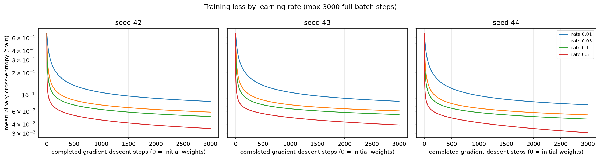
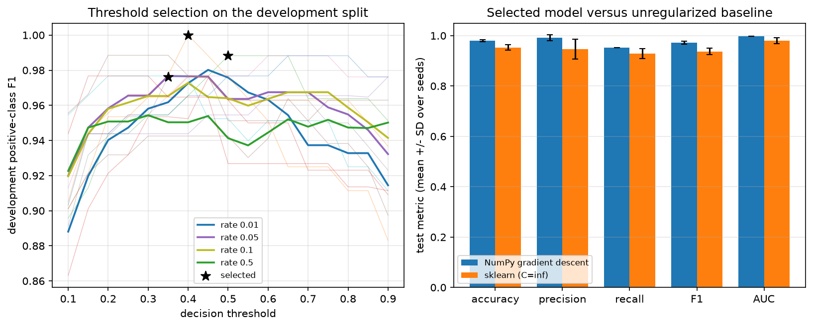

# Logistic regression: stable numerics and selection-safe evaluation

## Question and contribution

Can a handwritten binary logistic model be implemented with stable numerics and
evaluated without preprocessing or model-selection leakage? This rebuild of the
CSC 781 logistic-regression exercise compares NumPy full-batch gradient descent
with scikit-learn's unregularized LBFGS estimator on identical data.

[Implementation](../mlshowcase/logistic.py) · [Notebook](../notebooks/logistic.ipynb) ·
[Behavior tests](../tests/test_logistic.py) · [Measured JSON](../results/logistic.json)

My code implements the sigmoid, mean logit-based cross-entropy, analytic gradient,
optimizer, train-only scaler, and experiment driver. NumPy provides array/math
primitives; scikit-learn provides data, stratified splitting, metrics and LBFGS.
A from-scratch model does not imply a from-scratch scientific stack.

## Corrections and implementation

- **Stable sigmoid:** use separate positive/negative-score branches, exponentiating
  only non-positive values. Tests exercise scores of ±1000 without suppressing
  overflow warnings.
- **Stable objective:** compute cross-entropy from logits using `np.logaddexp`.
  The analytic gradient is checked against finite differences. Within each
  optimizer state, loss and gradient share the same matrix-vector product.
- **Training-only scaling:** fit population means/stds once on training data,
  then apply those statistics to development and test data. A constant training
  column gets scale 1, avoiding division by zero. The original normalized each
  split independently, creating inconsistent feature transformations.
- **Selected parameters:** retain the model belonging to the chosen learning
  rate, rather than evaluating the last model fitted by a tuning loop.
- **Explicit termination:** return the parameter state corresponding to the last
  recorded history entry. Stop on the gradient tolerance or step cap; non-finite
  states mark a fit as diverged and exclude it from selection.

These changes correct the original methodology; no original notebook outputs or
submission scores are reused.

## Protocol

- **Data:** bundled Wisconsin Diagnostic Breast Cancer, 569 rows × 30 features.
  Remap scikit-learn's malignant label 0 to **positive class 1**; benign becomes 0.
  Precision, recall and F1 therefore refer to malignancy, not benign cases.
- **Splits:** seeds 42/43/44, stratified 60/20/20 through the shared
  [split helper](../mlshowcase/common.py): 341 train / 114 development / 114 test.
- **Training:** zero-initialized parameters including intercept, four learning
  rates {0.01, 0.05, 0.1, 0.5}, maximum 3,000 full-batch steps, stopping tolerance
  `max(abs(gradient)) < 1e-6`.
- **Selection:** jointly maximize **unrounded development malignant-class F1**
  over four rates × 17 thresholds (0.10–0.90 by 0.05). Ties choose the smaller
  threshold, then smaller rate. Score only the selected model on held-out test.
- **Baseline:** `LogisticRegression(C=np.inf, solver="lbfgs", max_iter=10000,
  tol=1e-10)` with intercept, identical scaled training data and its **own**
  development-selected threshold from the same grid. No test-driven threshold
  or learning-rate choices.

## Measured results

Mean ± population standard deviation over the three seeds; full per-seed scores,
confusion matrices, histories and timings are preserved in the JSON.

| Held-out metric | NumPy GD | sklearn LBFGS |
| --- | --- | --- |
| Accuracy | 0.9795 ± 0.0041 | 0.9532 ± 0.0109 |
| Malignant precision | 0.9919 ± 0.0115 | 0.9464 ± 0.0388 |
| Malignant recall | 0.9528 ± 0.0005 | 0.9291 ± 0.0195 |
| Malignant F1 | **0.9719 ± 0.0057** | **0.9369 ± 0.0128** |
| ROC AUC | 0.9981 ± 0.0004 | 0.9796 ± 0.0121 |

Selected (rate, threshold): (0.01, 0.40), (0.01, 0.50), (0.05, 0.35) for
seeds 42/43/44. The baseline chose 0.10 throughout: its development F1 was flat
across this threshold grid, so the first maximum won.

All twelve GD fits reached the 3,000-step cap without satisfying the gradient
tolerance; none diverged. Higher rates lowered training loss further but were
not selected. LBFGS recorded 50/47/39 iterations under its own stopping rule.
The full protocol took roughly 0.72–0.76 seconds per seed on an AMD Ryzen 7
7840U; the four GD fits per seed contributed about 0.61–0.63 seconds. These are
single-machine timings, not a matched solver benchmark.





## Interpretation and limitations

The selected capped GD fits score better here, but the solvers do **not** share
an optimization endpoint or stopping rule. Fixed-budget GD may act as implicit
regularization; that is an **untested hypothesis**, not a measured explanation.
The experiment does not establish that handwritten GD is generally better than
LBFGS or isolate the cause of the difference.

The test sets have only 114 samples: each GD confusion matrix has two false
negatives and zero or one false positive. A few cases move F1 materially.
Three overlapping splits of one small dataset are not independent replications;
the reported standard deviation is not a confidence interval. Calibration,
external validation and clinical deployment were not studied. **Do not use this
experiment for diagnosis or treatment.**

## Reproduce and attribution

From the repository root:

```sh
uv run --locked python -m mlshowcase.logistic --output-dir results --seeds 42 43 44
```

This regenerates JSON and both figures. The companion notebook only reads that
evidence and demonstrates primitives on small synthetic inputs; it does not
rerun the recorded three-seed experiment. Environment versions are in the JSON.

Dataset: Wolberg, Mangasarian, Street & Street (1993), *Breast Cancer Wisconsin
(Diagnostic)*, UCI, [DOI 10.24432/C5DW2B](https://doi.org/10.24432/C5DW2B), CC BY 4.0.
Loaded through scikit-learn, not redistributed here. Full attribution and license
scope: [THIRD_PARTY_NOTICES.md](../THIRD_PARTY_NOTICES.md).
